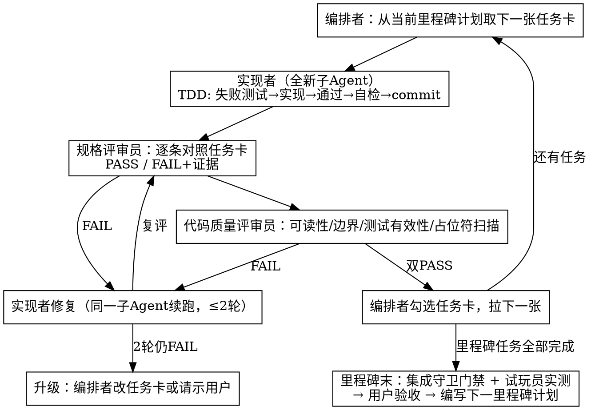

# 《星陨地牢》开发路线图与子 Agent 编排方案

- 日期：2026-08-28
- 版本：v1.2
- 依据：[主设计文档](../specs/2026-08-28-starfall-depths-design.md)（GDD）+ [数据表附录](../specs/2026-08-28-starfall-depths-data-tables.md)
- 方法论：superpowers（brainstorming → writing-plans → subagent-driven-development）
- 增补记录：v1.1 §2.1 并行波次规范；v1.2 M1 门禁（GREEN，tag `m1`）通过后细化 M2 规划（§6.1）——对齐 GDD §20 门禁口径、修正 M1/M2 分工重叠与附录勘误（数据表附录 A/D）

---

## 1. 总体开发步骤（里程碑链）

每个里程碑 = 一份独立任务级实施计划（`docs/superpowers/plans/`），独立产出可运行、可测试的软件。前一个门禁通过后，才编写并执行下一个里程碑的计划。

| 里程碑 | 交付物（来自 GDD §20） | 门禁（不过不进入下一阶段） | 计划文件 |
|---|---|---|---|
| **M0 战斗原型** | 移动/翻滚/射击/近战反弹、6 武器、4 敌人、1 战斗房+靶场、Juice v1、伤害/共鸣结算+单测 | GDD §18.5 手感清单全绿（试玩员实测） | [2026-08-28-m0-combat-prototype.md](./2026-08-28-m0-combat-prototype.md) |
| **M1 垂直切片（A1 完整一局）** | 地牢生成+全房型、商店/雕像/饮料/事件、小 Boss+藤蔓巨像、死亡结算+死亡回顾 v1、存档桩、HUD、骑士+游侠、武器 40、增益 15、元素共鸣完整接入战斗 | 新玩家 30min 完整体验 1 层并主动想开第 2 局（试玩员实测）；1000 种子地牢生成校验通过 | M0 门禁后编写 |
| **M2 全内容** | 3 层+6 Boss+6 角色、武器 115、敌人 40、增益 36、熔铸、蓝晶/天赋树/图鉴/成就全通 | GDD §14.3 可量化节奏目标全达标；1000 种子×3 生态校验通过；§18.3 性能预算达标（开发机 60fps；双平台 60fps 归 M3）。操作化口径见 §6.1 | [规划细化见 §6.1]（正式任务级计划已授权编写） |
| **M3 打磨发布** | Juice v2、平衡周（机器人回归）、试炼模式、设置/无障碍、Windows+Android 导出 | 双平台 60fps；无 P0/P1 缺陷；设置项齐全 | M2 门禁后编写 |

Backlog（明确不进 v1，防蔓延，来自 GDD §20/§21）：宠物 → 花园 → 无尽回廊 → 本地双人 → 云存档 → 每日种子排行榜。

## 2. 开发流程（任务卡生命周期）

硬规则：

1. **一任务一commit组**：实现者按任务卡的 commit 步骤提交，conventional commits（`feat:`/`test:`/`fix:`/`chore:`/`docs:`），message 带任务号（如 `feat(m0-t4): spatial hash`）。
2. **main 永远可运行**：只有双评审 PASS 后的代码才在 main 上（单人+Agent 流，不用特性分支；若需隔离可用 git worktree，见 superpowers:using-git-worktrees）。
3. **测试先行**：可测逻辑（数值/状态/生成/存档）必须 TDD；场景手感类任务的"手动验证"步骤不可跳过，由试玩员复核。
4. **内容表变更**走 Data Steward：改 `data/*.json` 的任务派数据管家，跑 schema 校验 + 掉落分布抽查。
5. **每 5 张任务卡**：试玩员抽查一次手感回归（防 juice/手感在迭代中劣化）。**（2026-09-01 用户裁定搁置——用户自测口径取代试玩员抽查，恢复需用户明示；M1/M2 全程复审曾判此规则实际未执行，现正式挂起）**
6. **GDD 数值改动 >±20%**：必须回写 GDD/附录对应表格（GDD 尾注约定）。

### 2.1 并行波次规范（v1.1 增补，用户指令：充分利用并行但不为小事并行）

**规划期（writing-plans 阶段就要做好）**——每张任务卡必须标注两件事，据此预先划波：

1. **依赖**（前置任务卡）；2. **文件所有权**（本卡独占的文件清单，与其他卡不相交）。

**分波规则：**
- 同一波内任务必须满足：依赖已满足 + 文件所有权互不相交 + 各自独立可测（对照 superpowers:dispatching-parallel-agents 的"独立问题域"判定）。
- **值得并行**的下限：单卡预计 ≥ 半天量级的实现工作（如 M0 的 t7/t10/t11 三卡）；纯 5 分钟小修、数据转录小卡不必并行——调度开销反超收益。
- **永不并行**：同文件任务（如共改 `player.tscn` 的 t8/t9）、集成收口任务（t12）、门禁验收（t13）、同一缺陷的修复循环。

**执行期机制：**
- 隔离：每张并行卡一个 git worktree（`.worktrees/<task-id>` + 同名分支），主树留给出波任务；worktree 内先 `--import` 再跑测试。
- 评审与合并：每卡完成即评审（评审是只读的，可与其它卡的实现并行）；评审通过后按序 merge 回 main，main 合并后跑全量测试。
- 并发上限：**每波 ≤3 个实现者**（评审带宽与合并冲突面考虑）。

**M1~M3 计划要求**：任务束分解时直接产出依赖图与 Wave 划分（如 M1 的 D 角色线 / E 数据线 / A 地牢线三线并行），收口线（G/H）串行殿后。

## 3. 子 Agent 职责表（RACI）

> 均由主会话（编排者）通过 Agent 工具派发；除编排者外每个实例职责单一、上下文自足（提示词自带任务卡全文 + 相关 GDD 章节）。

| # | 角色 | 承担者 | 职责 | 输入 | 输出 / 完成标准 |
|---|---|---|---|---|---|
| 0 | **总编排 Orchestrator** | 主会话（我） | 维护路线图与任务卡；派发与调度下述全部子 Agent；组织双评审；里程碑门禁汇总；唯一对用户沟通口。**不写实现代码** | GDD、本路线图、任务计划 | 每任务卡状态更新；门禁报告；向用户汇报 |
| 1 | **实现者 Implementer** | `general-purpose`（每任务全新实例） | 按任务卡逐步实现：写失败测试→实现→测试通过→自检（对照任务卡验收）→commit。允许运行 godot/python/node 命令验证 | 任务卡全文 + 全局约束 + 相邻任务接口签名 | commit 推至 main；自检报告（测试输出贴回） |
| 2 | **规格评审员 Spec Reviewer** | `general-purpose` | 拿任务卡逐条核对 diff：接口签名、数值与 GDD 一致、步骤全执行、无遗漏交付物 | 任务卡 + `git diff` 范围 | `PASS` 或 `FAIL + 逐条证据` |
| 3 | **代码质量评审员 Code Reviewer** | `general-purpose` | 评审代码质量：边界条件、热路径零分配、无占位符/TODO、测试是否真断言、命名与目录约定 | 同上 diff | `PASS` 或 `FAIL + 修改清单` |
| 4 | **数据管家 Data Steward** | `general-purpose` | 批量产出/校验 `data/*.json`（武器/敌人/增益/配方…按附录表转录）；跑 schema 校验与掉落分布抽样 | 附录 A~H 对应表 + schema 文件 | 校验通过的 JSON + 分布抽查结论 |
| 5 | **美术工程师 Artgen Engineer** | `general-purpose` | 维护 `tools/spritegen`（Python+Pillow）与 `tools/sfxgen`（Node）；产出 `art/generated/`、`audio/generated/`；跑调色板/剪影/对比度三重 QA 脚本 | GDD §16/§17 + 部件参数表 | 入库产物 + QA 报告（对比度≥30、剪影可辨） |
| 6 | **试玩员 Playtest Pilot** | `general-purpose` + computer-use 工具 | 启动游戏实机操作：按 GDD §18.5 手感清单逐项验证（输入延迟、翻滚无敌、TTK、反馈触发、可玩性主观项）；截图留证 | 可运行构建 + 清单 | `PASS/FAIL + 每项证据` 的门禁报告（`docs/superpowers/reports/`） |
| 7 | **集成守卫 Integration Guard** | `general-purpose` | 门禁执行者：全量无头测试、1000 种子生成校验（M1+）、性能冒烟（实体/弹幕上限压测）、汇总各报告出结论 | 里程碑门禁清单 | 门禁结论（绿/红 + 缺陷清单） |
| 8 | **平衡机器人 Balance Bot** | `general-purpose`（M2 起启用） | 无头自动游玩整局（启发式走位+随机），统计胜率/死亡热房/DPS 曲线，对照 GDD §14.3 目标值回归 | 可无头运行的游戏 + 统计脚本 | 平衡回归报告（周更） |

**派发提示词模板要点**（编排者拼装）：`你是<角色>。只做任务卡 N。以下是任务卡全文/全局约束/接口签名。完成后输出自检报告。禁止改动任务卡外文件。`——每个实例不携带其他任务上下文，接口靠任务卡的 Consumes/Produces 块传递。

## 4. 环境基线（所有实现者任务的前提）

- **引擎**：Godot 4.x stable（Task m0-t1 安装并锁版本，`godot --version` 写入 `docs/superpowers/reports/env.md`）
- **测试**：GdUnit4（addons/gdUnit4），无头命令 `godot --headless -s res://addons/gdUnit4/bin/GdUnitCmdTool.gd -a res://tests`（Task m0-t1 验证并固化到 `tools/run_tests.cmd`）
- **工具链**：Python 3.12 + Pillow 12（spritegen）、Node 22（sfxgen）、winget（装机）
- **平台**：Windows 11 开发机（win32），Git Bash

## 5. 全局约束（每个任务卡隐含继承，来自 GDD）

1. 逻辑固定 60Hz（`_physics_process`），渲染插值后期再开；禁止在逻辑代码用墙钟（`Time.*`）。
2. 伤害固定值，暴击唯一随机乘区；最终伤害=max(1, int(base×全局乘区×(暴击?2:1)))。
3. 逻辑随机只经 `RngSvc`（种子链），禁 `randi()/randf()`；时间用物理帧计数（60帧=1s）。
4. 热路径（弹幕/粒子/伤害数字）零每帧分配，全部池化；同屏弹幕 ≤500。
5. 全内容数据驱动（`data/*.json`），场景零硬编码数值。
6. 渲染 480×270、nearest 过滤、canvas_items 拉伸。
7. 代码/标识符英文，玩家可见文案中文。
8. 玩法数值以 GDD 附录为准；实现者发现表内矛盾 → 停止并上报编排者，不得自行改表。

## 6. 里程碑内任务束分解（M1~M3 的任务卡粒度预告）

M1（约 22~26 张卡）：A 地牢生成器与校验 / B 房型框架（8 种）/ C 设施（商店黑商/雕像/饮料/事件/喷泉）/ D 骑士+游侠全技能与三端输入（含触屏虚拟摇杆）/ E 武器 40+增益 15（数据管家批量）/ F 藤蔓巨像+小 Boss×2 / G 局流程（选角→层间三选一→死亡结算+死亡回顾 v1→存档桩）/ H HUD+Juice v1.5。
M2（约 34~42 张卡）：细化规划见下 §6.1（v1.2）。
M3（约 12~16 张卡）：Juice v2、平衡周（Balance Bot 周回归 ×2）、试炼模式、设置与无障碍（屏震/色弱形状/自动瞄准开关）、双平台导出与性能达标、美术补课（暴击/元素弹专用帧 + 美术 QA 三重校验〔对比度/剪影/接缝〕——2026-09-01 M1/M2 全程复审补录：两项在 M2 计划化卡时无声掉出，显式转 M3）。

### 6.1 M2 规划细化（v1.2，M1 门禁通过后编写；正式任务卡由 writing-plans 产出）

**范围口径**（= GDD §20 全量 + M1 移交收口，交接清单见 `reports/m1-gate.md` §4）：3 层（A2/A3 新增，A1 危险地块补全）、Boss×5 + 小 Boss×4（池 6 补齐，含星陨先知隐藏门）、角色×4（法师/刺客/工程师/守护者）、武器 +75 至 115、敌人补齐至 40 + 精英 A3 双词缀收口、增益 +21 至 36、熔铸台、房间模板 +16 至 24、胜利结算完整（接 M1 桩）、死亡回顾完整（3s 致死回放）、蓝晶/天赋树/图鉴/成就、音频全套、性能达标。

> 与 v1.0 预告的差异勘误：①"精英词缀"整体移出 M2——M1 T12 已交付全部 6 词缀，M2 仅做 A3 双词缀叠加收口；②补入 v1.0 遗漏项：小 Boss×4、房间模板 A2/A3×16、A1 危险地块（藤蔓/滚石）、挑战房灾厄收口、胜利结算、隐藏 Boss 门、M1 移交加固、导出冒烟（GDD §21 要求"M1 起导出进 CI"，M1 未排卡，M2 必须补上）；③卡数由 30~36 上修（M1 单层 2 角色实际 26+1 张，M2 内容量约为其 3 倍）。

**前置串行波 W0（先于一切实现波）：**
> 审计补强（2026-08-30）：①M1 全分支终审（首次派发死于额度）并入本波并行执行，范围扩至含 codex 37k 行外部交付与三份文档修订的联合评审；②卡片总数上修为 **37~46 张**（新增 I 束）。

- **P0 契约补全**（设计先行，编排者+数据管家，≈2 卡）：①天赋树全表定稿——GDD 现状只有引用（§14.3 "10h 点满 60%"、成就"12 节点/全点亮"）而无节点/效果/蓝晶价格表，须新增附录并回写数据表；②图鉴解锁任务 49 条定稿（附录 A 现仅 2 个示例，且原示例引用蓝武「讯响」与局内增益「暴虐回响」，与"白/绿/蓝默认可用"矛盾，已在附录 A 勘误）；③成就↔系统信号接线表（24 条中 **22 条 M2 激活、试炼者/试炼大师 2 条随 M3 试炼激活**——GDD §20 M2"成就全通"按此口径理解）；④增益 +21 条的效果键白名单扩展。
- **S0 M1 移交加固**（≈1~2 卡）：真人鼠标完整一局复测（第一项，含 Boss 战三阶段观察）；telemetry fallback WRITE 截断加固；T27 评审 minors（SALT_LOOT 共享派生 / 拾取金币跨套件耦合 / 墙边掉落楔住 / 每房暴击重注入覆盖 buff）；起始房开火 nil-combat 报错；开局 reset 清跨局遥测。

**并行束与依赖**（每波 ≤3 实现者，束间文件所有权互不相交；**每束最后一张卡显式承担集成收口验证**——M1 计划外 T27 整合卡的教训）：

| 束 | 内容 | 预估卡数 | 依赖 |
|---|---|---|---|
| A 生态机制 | A2：暗视野（玩家光圈+公平性与性能）/冰面打滑/地刺/晶柱折射敌激光；A3：岩浆 DOT/间歇喷口/火雨；A1 补全：藤蔓减速/滚石；可破坏掩体收口+A2 起 Boss 房掩体重建敌技；危险地块与抗火/抗冰增益、守护者法阵的分区结算统一 | 5~6 | P0 |
| B 角色线 | 法师/刺客/工程师/守护者 技能+被动+蓝晶强化；**召唤物框架**（工程师炮台/分身诱饵/傀儡嘲讽/治疗法阵，复用 M1 护盾精灵经验）；heroes.json+选角 UI 扩展 | 4~5 | S0（基于加固后基线） |
| C 数据线（管家） | 武器 +75（schema v2、1 万抽 sanity、同名不重复掉落）、敌人补齐 40、增益 +21、配方 15+通用升级+熔铸台、A2/A3 房间模板×16、精英 A3 双词缀 | 4~5 | P0 |
| D Boss 线 | 宝石蜂后/晶棱魔像（激光折射与 A 束联动）/寒渊蛛母/熔核暴君/星陨先知（隐藏门：携带任意共鸣击杀 A3 小 Boss）+ 小 Boss×4 | 6~7 | A、C（蜂后可提前） |
| E 局外线 | 蓝晶结算完整、天赋树（P0 表落地）、图鉴+解锁任务引擎、成就（22 激活+2 预留）、存档 migration v2 | 4 | P0、C |
| F 流程收口 | 胜利结算完整、死亡回顾完整（致死 3s 高亮回放——优先确定性重放，符合 §18.2 种子化架构）、挑战房灾厄收口、房型接线与层内去重复核 | 3~4 | D、E |
| G 音频线 | 新增 audio_mgr autoload、sfxgen 全套（11 类射击/暴击升调/连击音高/Boss 吼）、musicgen 5 曲（菜单 1+生态 3+Boss 1）、Boss 战动态切层 | 2~3 | —（可最早并行） |
| I 美术深化（审计补强 2026-08-30：承接用户「真美术接线」范围项，§6.1 原稿遗漏） | 程序化美术深化：英雄 4 向行走帧（idle+walk 2~4 帧）+ 受击帧；敌人 2 帧待机/行走（40 种，生成器参数化扩充）；A2/A3 瓦片接线验证（T28 已接 A1）；暴击/元素弹专用帧；美术 QA 三重校验（对比度/剪影/接缝） | 3~4 | P0（生成器已在） |
| H 性能与门禁 | **Balance Bot 提前至 W1 启用**（先跑 A1 无头周报，随束扩展至全层——不留到末期）、§18.3 全指标压测、Windows 导出冒烟+Android 导出链预通、M2 门禁 | 3 | 贯穿+殿后 |

> 审计补记 2026-09-01（M1/M2 全程复审）：I 束「暴击/元素弹专用帧」「美术 QA 三重校验」两项未随 M2 计划落卡（无声收窄），已显式移交 M3（见 §6 M3 行）；其余项已随 M2 T17/T21/T27 交付。另：门禁操作化第 3 条的「蓝晶节奏三点抽样（经济模拟）」与「单层/单局时长两带」在 M2 门禁中无数据（bot 止步 F1、模拟未建）——随 M3 计划补立经济模拟卡；时长数据原拟真人 checklist 增项，真人项搁置（裁定㉝）后改为用户自测时随手计时或经济模拟卡顺带产出。

**门禁操作化**（裁定依据；"§14.3 全达标"按可测口径执行）：

1. 1000 种子 ×3 生态生成校验 100% PASS（集成守卫）；
2. §18.3 全指标：实体 ≤300 / 弹 ≤500 / draw ≤150 / 逻辑帧 ≤6ms / 渲染 ≤10ms，开发机 60fps；
3. §14.3 可量化项进带：单房 20~40s / 单层 8~12min / 单局 25~35min / TTK（遥测+Balance Bot 统计）；蓝晶节奏三点抽样（2~3h 首个付费角色 / 10h 天赋 60% / 20h 图鉴 80%，经济模拟）；**真人胜率曲线（新手 10%→20h+ 40%）为上线后持续收集项，不作 M2 硬门禁**，以 Balance Bot 胜率带回归代替；
4. 试玩员：真人完整通关一局（3 层含 Boss）+ 死亡可归因复查 + S0 复测项闭环（**2026-09-01 用户裁定搁置**——用户自行游玩回报问题，不再作为门禁前置；M3 门禁的试玩员项同口径挂起，待用户明示恢复）；
5. 集成守卫惯例项：全量测试绿、存档往返、工作树干净。

## 7. 风险触发的流程调整

| 触发信号 | 调整动作 |
|---|---|
| M0 门禁 FAIL（手感不达标） | 只允许改手感参数（GDD §5.2/§5.3 数值域内）再测 2 轮；仍不达标→升级给用户改设计数值 |
| 同一任务卡 2 轮修复仍 FAIL | 编排者拆卡重写，必要时升级用户 |
| 无头测试发现 GDD 表矛盾 | 冻结相关任务卡 → 修 GDD/附录 → 提交 → 继续执行 |
| 性能冒烟超标 | 先降粒子→再降实体上限→最后才考虑架构变更（升级用户） |
| Godot/平台环境阻塞 >半天 | 切换备选安装方式（官网 zip 直装），必要时升级用户 |
